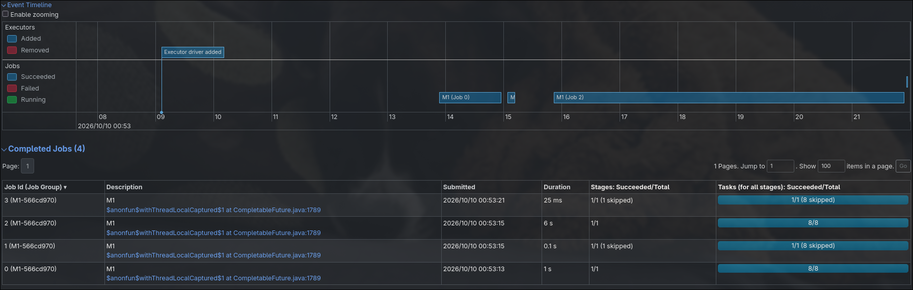
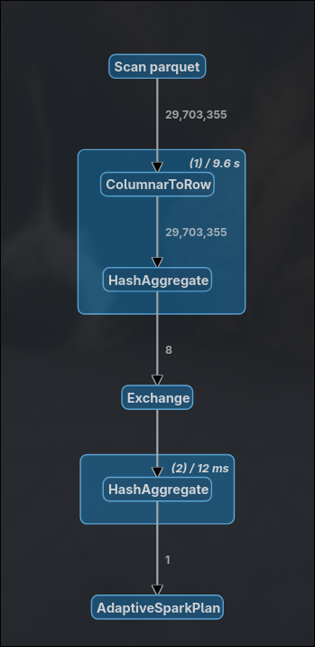
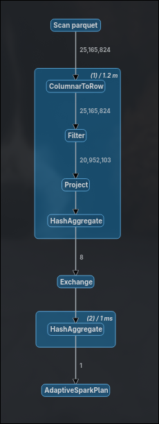

# Example Report

- Date: 2026-10-10

## Findings

### Bottleneck

No bottleneck was found this is an example after all

### Plans

### Physical

The plan has 2 steps not much can be explain tbh.

### Logical

The plan is simple just `isNotNull` and the conditions asked in the assignment.

## Pre Fix

### Evidence

#### Pipeline

#### SQL

##### 0

##### 1

#### Logs

[**Logs**](example.log)

### Reproducing

**Git Commit Hash:** `954f0fe4b90dc9931adcab946ae32b8a708cc599` (This is not an hash from this repo btw)
**UV Command:** `uv run proj1 M1 -v > reports/example/found-example.log`

## Post Fix

Just imagine something changed.

### Evidence

#### Pipeline

This is a pipeline image btw.

#### SQL

##### 0

This is a sql image btw.

#### Logs

This are logs that are totally true btw.

### Reproducing

**Git Commit Hash:** `ded93afd36f82341e642f8dfc8bd6001c8f58b0a` (This is not an hash from this repo btw)
**UV Command:** `uv run proj1 M1 -v > reports/example/found-example.log`
